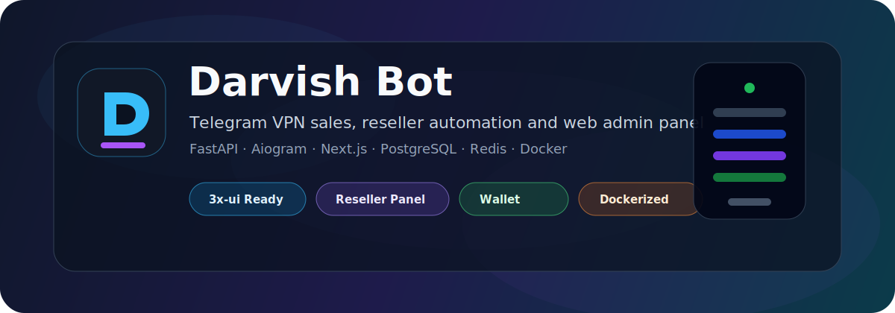
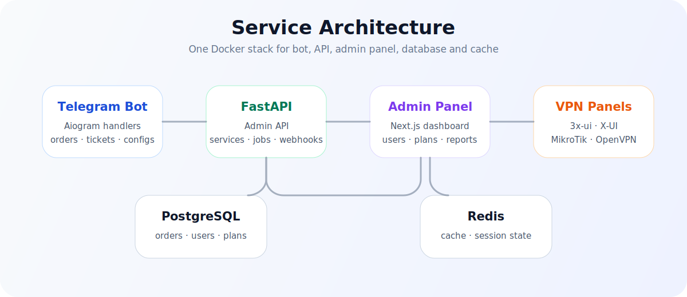

<p align="center">
  
</p>

<h1 align="center">Darvish Bot</h1>

<p align="center">
  <b>Professional Telegram VPN sales, reseller automation and web admin panel.</b>
</p>

<p align="center">
  <a href="./README.md">🇺🇸 English</a> · <a href="./README_FA.md">🇮🇷 فارسی</a>
</p>

<p align="center">
  <a href="https://t.me/officialdarvishchannel"></a>
  <a href="https://t.me/officialdarvish_bot"></a>
  <a href="https://nowpayments.io/donation/officialdarvish"></a>
</p>

<p align="center">
  
  
  
  
  
  
  
  
</p>

<p align="center">
  
</p>

---

## ✨ Overview

**Darvish Bot** is a production-oriented Telegram bot and web admin panel for selling and managing VPN services. It handles user purchases, reseller traffic packages, wallet balance, card-to-card payments, crypto payments, tickets, server management, service delivery and admin reporting.

<table>
  <tr>
    <td align="center"><b>🤖 Telegram Bot</b><br/>User panel, purchases, configs, tickets</td>
    <td align="center"><b>🖥️ Admin Panel</b><br/>Users, plans, servers, payments, reports</td>
    <td align="center"><b>👥 Resellers</b><br/>Traffic packages, reseller users, refunds</td>
  </tr>
  <tr>
    <td align="center"><b>🔗 Panel Sync</b><br/>3x-ui, X-UI, Sanaei, MikroTik flow</td>
    <td align="center"><b>💳 Payments</b><br/>Wallet, card-to-card, NOWPayments</td>
    <td align="center"><b>🐳 Docker</b><br/>API, bot, PostgreSQL, Redis stack</td>
  </tr>
</table>

---

## 🆕 v1.1.4 Highlights

This release documents the current project state and includes the latest bot-side workflow changes:

| Area | Current behavior |
|---|---|
| Pay As You Go | Runtime Pay As You Go flow is removed from the bot; only startup cleanup keeps old database artifacts from previous versions from interfering. |
| Admin-only free flow | Full-access owners/admins can create and renew all service types for free; regular users still use the normal payment flow. |
| User interaction | Admins can manage a user wallet from **User Interaction → Wallet**, choose increase/decrease, enter the numeric Telegram ID, then enter the amount. |
| User lookup | User information lookup is based only on the numeric Telegram ID for accurate results. |
| Error reports | Admin error reports are shorter, cleaner and focused on the exact error, user, chat, callback/message and traceback location. |
| Creation/renewal UX | Users, resellers and admins see a progress message while the service is being created, renewed and sent. |
| Success navigation | After successful creation or renewal, the bot sends a success message with a **Home** button that returns the user to the main menu. |
| Reseller notifications | When a reseller creates a user, the owner/admin receives a short summary with custom name, volume, duration and expiry date. |

---

## 🚀 Quick Install

Install on a fresh VPS with one command:

```bash
bash <(curl -Ls https://raw.githubusercontent.com/officialdarvish/D_bot/main/install.sh)
```

After system packages and Docker are installed, the installer opens an interactive setup wizard so the VPS owner can complete the project step by step.

| Step | What the installer asks for |
|---|---|
| 1 | Telegram bot token and owner/admin Telegram ID |
| 2 | Domain name, optional Let’s Encrypt HTTPS, and public Nginx ports |
| 3 | Web admin username and password, auto-generated or custom |
| 4 | PostgreSQL database name, user and password |
| 5 | Public web/API port, timezone and optional Telegram channel URL |
| 6 | Final review before writing `.env` and starting services |

<details>
<summary>Setup wizard preview</summary>

```text
╔══════════════════════════════════════════════════════════════╗
║                    D Bot Setup Wizard                       ║
╠══════════════════════════════════════════════════════════════╣
║ Fill the required values step by step.                      ║
║ Secrets will be saved only inside /opt/d-bot/.env.          ║
╚══════════════════════════════════════════════════════════════╝

Step 1/6 — Telegram Bot
The token is visible while typing so you can verify it before saving.
Telegram Bot Token: 123456789:AAExample_Token-Value
Owner/Admin Telegram ID: 123456789

Step 2/6 — Website Domain & HTTPS
Domain name: panel.example.com
Enable HTTPS with Let’s Encrypt? [Y/n]: y
Use custom Nginx public ports? [y/N]: n

Step 3/6 — Web Admin Panel
Auto-generate web admin username/password? [Y/n]: y

Step 6/6 — Review
Web login          : https://panel.example.com/login
Web username       : admin_a1b2c3
Save this setup and continue installation? [Y/n]: y
```

</details>

After installation, open the graphic Control Center with either command. From this menu you can view/edit the values entered in Setup Wizard and manage services:

```bash
dbot
dbot menu
```

Or use only these direct manager commands:

```bash
dbot status
dbot logs
dbot restart
dbot start
dbot stop
dbot update
dbot backup
dbot uninstall --purge
```

---

## 🧩 Features

| Area | What it includes |
|---|---|
| 🤖 Telegram user panel | Buy services, manage configs, renew services, delete configs, wallet, tickets, guides, progress messages and success Home button |
| 🖥️ Web admin panel | Manage users, plans, categories, servers, payments, reports, test accounts, settings and admin wallet operations |
| 👥 Reseller system | Reseller packages, traffic balance, reseller users, unused-volume refund on deletion and short admin notifications for reseller-created configs |
| 🔗 X-UI / 3x-ui integration | Create, delete, renew, rotate UUID and sync clients across supported panels |
| 🌐 MikroTik / OpenVPN | User creation and management for MikroTik-based services |
| 🧭 Multi-server support | Add multiple servers, categories, service types and inbound IDs |
| 💳 Wallet & payments | Wallet payments, admin wallet increase/decrease by numeric Telegram ID, card-to-card receipt approval and order tracking |
| ₿ Crypto payments | NOWPayments integration with IPN webhook support |
| 🏷️ Discount codes | Percent/fixed discounts, global usage limit, per-user limit and server scoping |
| 🎫 Tickets | User support tickets with admin replies and close actions |
| 🔔 Admin alerts | Notify owners/admins about new users, reseller-created configs and short structured runtime errors |
| 🧰 Backup & restore | Project/database backup, restore and migration helper commands |
| 🐳 Docker deployment | API, bot, PostgreSQL, Redis and admin panel in a Docker-based stack |

---

## ⛓️ Supported Panels

<table>
  <tr>
    <td align="center"><b>3x-ui</b></td>
    <td align="center"><b>X-UI</b></td>
    <td align="center"><b>Sanaei X-UI</b></td>
    <td align="center"><b>MikroTik / OpenVPN</b></td>
    <td align="center"><b>Multi-inbound Xray</b></td>
  </tr>
</table>

---

## 🏗️ Architecture

<p align="center">
  
</p>

```text
Darvish Bot
├── app/                  Python backend, bot handlers, API, jobs and services
├── frontend/             Next.js web admin panel
├── scripts/              Helper scripts
├── Dockerfile            Main production Docker build
├── docker-compose.yml    API, bot, PostgreSQL and Redis services
├── install.sh            One-command VPS installer
├── README.md             English documentation
└── README_FA.md          Persian documentation
```

---

## 📦 Manual Installation

```bash
git clone https://github.com/officialdarvish/D_bot.git
cd D_bot
git checkout v1.1.4
cp .env.example .env
nano .env
docker compose up -d --build
```

Admin panel URL:

```text
https://YOUR_DOMAIN/login
```

---

## ⚙️ Environment Configuration

Create a `.env` file in the project root and set your private values.

```env
BOT_TOKEN=CHANGE_ME_BOT_TOKEN
OWNER_IDS=123456789
DATABASE_URL=postgresql+asyncpg://dbot:CHANGE_ME_DB_PASSWORD@db:5432/d_bot
POSTGRES_DB=d_bot
POSTGRES_USER=dbot
POSTGRES_PASSWORD=CHANGE_ME_DB_PASSWORD
WEB_ADMIN_USERNAME=admin
WEB_ADMIN_PASSWORD=CHANGE_ME_STRONG_PASSWORD
FERNET_KEY=CHANGE_ME_FERNET_KEY
JWT_SECRET=CHANGE_ME_JWT_SECRET
```

> Never publish your real `.env`, bot token, API keys, panel credentials, server IPs or database passwords.

---

## ₿ NOWPayments Crypto Payments

Darvish Bot can create crypto payment invoices through NOWPayments and process payment status updates through an IPN webhook.

```env
NOWPAYMENTS_ENABLED=true
NOWPAYMENTS_API_KEY=YOUR_API_KEY
NOWPAYMENTS_IPN_SECRET=YOUR_IPN_SECRET
NOWPAYMENTS_PAY_CURRENCY=trx
NOWPAYMENTS_PRICE_CURRENCY=usd
NOWPAYMENTS_IPN_CALLBACK_URL=https://YOUR_DOMAIN/webhooks/nowpayments
```

Webhook endpoint:

```text
/webhooks/nowpayments
```

Orders are marked as paid after confirmed final payment statuses such as `confirmed`, `finished` or `sending`.

---

## 🏷️ Discount Codes

Discount codes support:

- Percent-based discounts
- Fixed-amount discounts
- Global usage limit
- Per-user usage limit
- Optional server/category scoping
- Activate, deactivate, edit and delete actions from the admin panel

---

## 🕹️ Graphic Control Center

The installer adds an interactive VPS control center. Run it with:

```bash
dbot
```

The menu can now **display and edit the values entered during the setup wizard**. Sensitive values are hidden by default and can only be revealed from the terminal after confirmation.

```text
╔══════════════════════════════════════════════════════════════╗
║                    D Bot Control Center                     ║
║        Setup viewer, editor and VPS service manager         ║
╚══════════════════════════════════════════════════════════════╝

Project : D Bot
Path    : /opt/d-bot
Panel   : https://panel.example.com/login
Domain  : panel.example.com
HTTPS   : true

1) Status                  Show containers
2) Logs                    Live logs, Ctrl+C to exit
3) Restart                 Restart all services
4) Start                   Start services
5) Stop                    Stop services
6) Update                  Pull/rebuild and restart
7) Backup                  Create a full backup
8) Setup Info              View values from setup wizard
9) Edit Setup              Change saved .env values
10) Apply Nginx/SSL        Rebuild reverse proxy/certificate
11) Show Secrets           Reveal saved credentials
12) Uninstall --purge      Remove app and backups
0) Exit
```

Editable setup sections:

| Section | Editable values |
|---|---|
| Telegram | Bot token, admin/owner IDs, default channel URL |
| Website & SSL | Domain, HTTPS on/off, Let’s Encrypt email, internal API port, and Nginx HTTP/HTTPS ports |
| Web Admin | Admin username and password |
| Runtime | Timezone and server sync interval |
| Database | PostgreSQL values with an advanced safety warning |

Control Center commands:

| Command | Description |
|---|---|
| `dbot` | Open the graphic Control Center |
| `dbot menu` | Open the same Control Center from VPS |

Direct commands are also supported:

| Command | Description |
|---|---|
| `dbot status` | Show container status |
| `dbot logs` | Show live logs |
| `dbot restart` | Restart all services |
| `dbot start` | Start services |
| `dbot stop` | Stop services |
| `dbot update` | Pull/rebuild and restart |
| `dbot backup` | Create a backup |
| `dbot uninstall --purge` | Remove the app and delete backups |

---

## 🔐 Security Checklist Before Public Release

- Do not commit `.env` or real credentials.
- Do not commit panel URLs, panel usernames, passwords or tokens.
- Remove runtime files such as logs, backups, dumps, zips and cache files.
- Use `CHANGE_ME` placeholders for examples.
- Rotate any token that was ever committed publicly.

---

## 🔗 Official Links

| Platform | Link |
|---|---|
| Telegram Channel | [officialdarvishchannel](https://t.me/officialdarvishchannel) |
| Telegram Bot | [@officialdarvish_bot](https://t.me/officialdarvish_bot) |
| GitHub Repository | [officialdarvish/D_bot](https://github.com/officialdarvish/D_bot) |
| Donation | [NOWPayments](https://nowpayments.io/donation/officialdarvish) |

---

## ❤️ Support the Project

If Darvish Bot helps you, you can support future development with a crypto donation:

<p align="center">
  <a href="https://nowpayments.io/donation/officialdarvish">
    
  </a>
</p>

---

<p align="center">
  Built with ❤️ by <a href="https://github.com/officialdarvish">Darvish</a>
</p>
