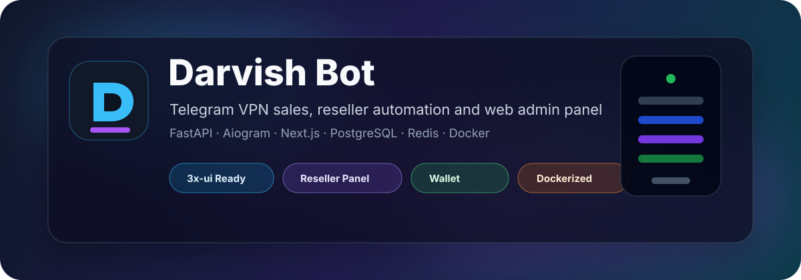

<p align="center">
  
</p>

<h1 align="center">Darvish Bot</h1>

<p align="center">
  <b>Professional Telegram VPN sales, reseller automation and web admin panel.</b>
</p>

<p align="center">
  <a href="./README.md">🇺🇸 English</a> · <a href="./README_FA.md">🇮🇷 فارسی</a>
</p>

<p align="center">
  <a href="https://t.me/officialdarvishchannel"></a>
  <a href="https://t.me/officialdarvish_bot"></a>
  <a href="https://nowpayments.io/donation/officialdarvish"></a>
</p>

<p align="center">
  
  
  
  
  
  
  
  
</p>

<p align="center">
  
</p>

---

## ✨ Overview

**Darvish Bot** is a production-oriented Telegram bot and web admin panel for selling and managing VPN services. It handles user purchases, reseller traffic packages, wallet balance, card-to-card payments, crypto payments, tickets, server management, service delivery and admin reporting.

<table>
  <tr>
    <td align="center"><b>🤖 Telegram Bot</b><br/>User panel, purchases, configs, tickets</td>
    <td align="center"><b>🖥️ Admin Panel</b><br/>Users, plans, servers, payments, reports</td>
    <td align="center"><b>👥 Resellers</b><br/>Traffic packages, reseller users, refunds</td>
  </tr>
  <tr>
    <td align="center"><b>🔗 Panel Sync</b><br/>3x-ui, X-UI, Sanaei, MikroTik flow</td>
    <td align="center"><b>💳 Payments</b><br/>Wallet, card-to-card, NOWPayments</td>
    <td align="center"><b>🐳 Docker</b><br/>API, bot, PostgreSQL, Redis stack</td>
  </tr>
</table>

### 🎨 Custom Text Center UI

The Custom Center interface itself is now fully English (headings, filters, category/stage tags, statuses, editor controls and confirmations), while the actual user-facing bot message content remains in its original language and uses automatic text direction in the editor and preview.

The web admin **Custom** section is now a user-journey editor rather than a broad source-string scanner. It only catalogs text that a normal Telegram user can actually see across start/menu, purchase, payment and receipt review, service delivery, renewals, My Services, wallet/account, tickets, test accounts, reseller flows, private messages, referrals and service alerts. Every item carries a clear English **category** and **journey-stage** tag in the web UI, with dedicated filters for both. The underlying Telegram message text remains unchanged and can still be Persian. Dynamic final messages such as the post-receipt purchase success message, complete service-delivery card and renewal confirmation are explicitly templated so they can be edited safely while preserving runtime placeholders. The UI keeps deferred search and progressive rendering for large catalogs.

### 🎥 YouTube

- [Official Darvish YouTube Channel](https://www.youtube.com/@officialdarvish)
- [D Bot Introduction & Installation Tutorial](https://youtu.be/gzTt6hj752A?si=NP7Mwnb17jMunGaH)

---

## 🚀 Quick Install

Install on a fresh VPS with one command:

```bash
bash <(curl -Ls https://raw.githubusercontent.com/officialdarvish/D_bot/main/install.sh)
```

The installer asks for the domain **before every other setting**. It then installs/starts Nginx, validates the ACME webroot and obtains the Let’s Encrypt certificate. A temporary HTTPS “installation in progress” page stays online while Docker is installed and the application is built. Nginx switches to the API only after `/health` succeeds, so visitors do not see a temporary 502 page.

| Stage | What happens |
|---|---|
| First | Domain and optional Let’s Encrypt email are collected; DNS, ports 80/443, Nginx and SSL are checked immediately |
| 1 | Telegram bot token and owner/admin Telegram ID |
| 2 | Web admin username and password, auto-generated or custom |
| 3 | PostgreSQL database name, user and password |
| 4 | Internal API port, timezone and optional Telegram channel URL |
| 5 | Final review before writing `.env` and starting services |

<details>
<summary>Setup wizard preview</summary>

```text
╔══════════════════════════════════════════════════════════════╗
║                    D Bot Setup Wizard                       ║
╠══════════════════════════════════════════════════════════════╣
║ Fill the required values step by step.                      ║
║ Secrets will be saved only inside /opt/d-bot/.env.          ║
╚══════════════════════════════════════════════════════════════╝

First stage — Domain & SSL
Domain name: panel.example.com
Let’s Encrypt email, optional: admin@example.com
Start Nginx and request SSL now? [Y/n]: y
✓ HTTPS bootstrap page is active: https://panel.example.com

Step 1/5 — Telegram Bot
Telegram Bot Token: 123456789:AAExample_Token-Value
Owner/Admin Telegram ID: 123456789

Step 2/5 — Web Admin Panel
Auto-generate web admin username/password? [Y/n]: y

Step 5/5 — Review
SSL certificate    : active
Web login          : https://panel.example.com/login
Web username       : admin_a1b2c3
Save this setup and continue installation? [Y/n]: y
```

</details>

After installation, open the graphic Control Center with either command. From this menu you can view/edit the values entered in Setup Wizard and manage services:

```bash
dbot
dbot menu
```

Or use only these direct manager commands:

```bash
dbot status
dbot logs
dbot restart
dbot start
dbot stop
dbot update
dbot backup
dbot credentials
dbot uninstall --purge
```

---

## 🧩 Features

| Area | What it includes |
|---|---|
| 🤖 Telegram user panel | Buy services, manage configs, renew services, delete configs, wallet, tickets, guides, progress messages and success Home button |
| 🖥️ Web admin panel | Manage users, plans, categories, servers, payments, reports, test accounts, settings and admin wallet operations |
| 👥 Reseller system | Reseller packages, sellable inventory accounting, cumulative used traffic, active reserved volume, reseller users and short admin notifications for reseller-created configs |
| 🔗 X-UI / 3x-ui integration | Create, delete, renew, rotate UUID and sync clients across supported panels |
| 🌐 MikroTik / OpenVPN | User creation and management for MikroTik-based services |
| 🧭 Multi-server support | Add multiple servers, categories, service types and inbound IDs |
| 💳 Wallet & payments | Wallet payments, admin wallet increase/decrease by numeric Telegram ID, card-to-card receipt approval and order tracking |
| ₿ Crypto payments | NOWPayments integration with IPN webhook support |
| 🏷️ Discount codes | Percent/fixed discounts, global usage limit, per-user limit and server scoping |
| 🎫 Tickets | User support tickets with admin replies and close actions |
| 🔔 Admin alerts | Notify owners/admins about new users, reseller-created configs and short structured runtime errors |
| 🧰 Backup & restore | Portable cross-install JSON backup, full database synchronization, credential re-encryption and migration helper commands |
| 🔐 Credentials Center | Live website login URL, current username/password, direct username/password changes, secure password generation and infrastructure-secret view |
| 🐳 Docker deployment | API, bot, PostgreSQL, Redis and admin panel in a Docker-based stack |

---

## 🧳 Portable Backup & Cross-Installation Restore

Backups created from the web admin panel use portable format `4` and can be restored on another VPS or on multiple separate D BOT installations.

- All supported persistent database tables are exported and synchronized on restore.
- Server panel passwords are moved through a self-contained encrypted backup envelope and are encrypted again with the destination installation's own `FERNET_KEY`.
- The destination `.env`, `BOT_TOKEN`, database connection and runtime infrastructure are not replaced.
- A SHA-256 integrity checksum detects incomplete or modified backup files.
- Restore performs credential and structure preflight checks before deleting destination data.
- Old formats `1` to `3` remain readable when their server credentials can be decrypted with the current key. For a legacy backup created with another `FERNET_KEY`, update the source installation and create a new portable backup.

When only a legacy JSON file and the old source `FERNET_KEY` are available, convert it locally:

```bash
python3 scripts/convert_legacy_backup.py dbot_backup.json dbot_portable_backup_v4.json
```

The converter requests the old key with hidden input, or accepts `LEGACY_FERNET_KEY` from the environment.

> Portable backups contain recoverable service credentials. Keep every backup file private and send it only through a trusted destination.

---

## ⛓️ Supported Panels

<table>
  <tr>
    <td align="center"><b>3x-ui</b></td>
    <td align="center"><b>X-UI</b></td>
    <td align="center"><b>Sanaei X-UI</b></td>
    <td align="center"><b>MikroTik / OpenVPN</b></td>
    <td align="center"><b>Multi-inbound Xray</b></td>
  </tr>
</table>

---


## 🎛️ Custom Bot Text Center

The web admin panel includes **Custom** directly above **Settings**. The catalog is intentionally scoped to the **normal user's interaction surface**, not every Persian string in the project. It scans public bot handlers and user-notification paths only, and excludes admin-only handlers, internal services, callback data, API/database values, logs and technical strings. Each editable item has an English category tag (for example Purchase & Payment, My Configs, Account & Wallet, Support & Tickets, Reseller) plus a more specific English journey-stage tag (for example Receipt & Approval, Service Delivery, Renewal Result). Important composed outputs are explicitly templated, including the final message after a card-to-card receipt is approved, the full delivered-service card, renewal confirmations and receipt-rejection messages. Dynamic placeholders such as usernames, plan names, amounts and traffic values remain available for safe customization. Overrides are stored in the existing `settings` table, so no migration is required.

<!-- D BOT Custom Text Center -->

## 🏗️ Architecture

<p align="center">
  
</p>

```text
Darvish Bot
├── app/                  Python backend, bot handlers, API, jobs and services
├── frontend/             Next.js web admin panel
├── scripts/              Helper scripts
├── Dockerfile            Main production Docker build
├── docker-compose.yml    API, bot, PostgreSQL and Redis services
├── install.sh            One-command VPS installer
├── README.md             English documentation
└── README_FA.md          Persian documentation
```

---

## 📦 Manual Installation

```bash
git clone https://github.com/officialdarvish/D_bot.git
cd D_bot
cp .env.example .env
nano .env
docker compose up -d --build
```

Admin panel URL:

```text
https://YOUR_DOMAIN/login
```

---

## ⚙️ Environment Configuration

Create a `.env` file in the project root and set your private values.

```env
BOT_TOKEN=CHANGE_ME_BOT_TOKEN
OWNER_IDS=123456789
DATABASE_URL=postgresql+asyncpg://dbot:CHANGE_ME_DB_PASSWORD@db:5432/d_bot
POSTGRES_DB=d_bot
POSTGRES_USER=dbot
POSTGRES_PASSWORD=CHANGE_ME_DB_PASSWORD
WEB_ADMIN_USERNAME=admin
WEB_ADMIN_PASSWORD=CHANGE_ME_STRONG_PASSWORD
FERNET_KEY=CHANGE_ME_FERNET_KEY
JWT_SECRET=CHANGE_ME_JWT_SECRET
```

> Never publish your real `.env`, bot token, API keys, panel credentials, server IPs or database passwords.

---

## ₿ NOWPayments Crypto Payments

Darvish Bot can create crypto payment invoices through NOWPayments and process payment status updates through an IPN webhook.

```env
NOWPAYMENTS_ENABLED=true
NOWPAYMENTS_API_KEY=YOUR_API_KEY
NOWPAYMENTS_IPN_SECRET=YOUR_IPN_SECRET
NOWPAYMENTS_PAY_CURRENCY=trx
NOWPAYMENTS_PRICE_CURRENCY=usd
NOWPAYMENTS_IPN_CALLBACK_URL=https://YOUR_DOMAIN/webhooks/nowpayments
```

Webhook endpoint:

```text
/webhooks/nowpayments
```

Orders are marked as paid after confirmed final payment statuses such as `confirmed`, `finished` or `sending`.

---

## 🏷️ Discount Codes

Discount codes support:

- Percent-based discounts
- Fixed-amount discounts
- Global usage limit
- Per-user usage limit
- Optional server/category scoping
- Activate, deactivate, edit and delete actions from the admin panel

---

## 🕹️ Graphic Control Center

The installer adds an interactive VPS control center. Run it with:

```bash
dbot
```

The menu can now **display and edit the values entered during the setup wizard**. Sensitive values are hidden by default and can only be revealed from the terminal after confirmation.

```text
╔══════════════════════════════════════════════════════════════╗
║                    D Bot Control Center                     ║
║        Setup viewer, editor and VPS service manager         ║
╚══════════════════════════════════════════════════════════════╝

Project : D Bot
Path    : /opt/d-bot
Panel   : https://panel.example.com/login
Domain  : panel.example.com
HTTPS   : true

1) Status                  Show containers
2) Logs                    Live logs, Ctrl+C to exit
3) Restart                 Restart all services
4) Start                   Start services
5) Stop                    Stop services
6) Update                  Pull/rebuild and restart
7) Backup                  Create a full backup
8) Setup Info              View values from setup wizard
9) Edit Setup              Change saved .env values
10) Apply Nginx/SSL        Rebuild reverse proxy/certificate
11) Credentials Center     Live username/password and protected secrets
12) Uninstall --purge      Remove app and backups
13) Delete Old Backup      List and delete saved backups
0) Exit
```

Editable setup sections:

| Section | Editable values |
|---|---|
| Telegram | Bot token, admin/owner IDs, default channel URL |
| Website & SSL | Domain, HTTPS on/off, Let’s Encrypt email, internal API port, and Nginx HTTP/HTTPS ports |
| Web Admin | Live admin username/password through the Credentials Center; changes are synchronized with the database |
| Runtime | Timezone and server sync interval |
| Database | PostgreSQL values with an advanced safety warning |

Control Center commands:

| Command | Description |
|---|---|
| `dbot` | Open the graphic Control Center |
| `dbot menu` | Open the same Control Center from VPS |

Direct commands are also supported:

| Command | Description |
|---|---|
| `dbot status` | Show container status |
| `dbot logs` | Show live logs |
| `dbot restart` | Restart all services |
| `dbot start` | Start services |
| `dbot stop` | Stop services |
| `dbot update` | Pull/rebuild and restart |
| `dbot backup` | Create a backup |
| `dbot backups` | Open backup manager for individual/all deletion |
| `dbot backup-list` | List backups from oldest to newest |
| `dbot credentials` | Open the live graphical Credentials Center |
| `dbot uninstall --purge` | Remove the app and delete backups |

---

## 🔐 Security Checklist Before Public Release

- Do not commit `.env` or real credentials.
- Do not commit panel URLs, panel usernames, passwords or tokens.
- Remove runtime files such as logs, backups, dumps, zips and cache files.
- Use `CHANGE_ME` placeholders for examples.
- Rotate any token that was ever committed publicly.

---

## 🔗 Official Links

| Platform | Link |
|---|---|
| Telegram Channel | [officialdarvishchannel](https://t.me/officialdarvishchannel) |
| Telegram Bot | [@officialdarvish_bot](https://t.me/officialdarvish_bot) |
| GitHub Repository | [officialdarvish/D_bot](https://github.com/officialdarvish/D_bot) |
| Donation | [NOWPayments](https://nowpayments.io/donation/officialdarvish) |

---

## ❤️ Support the Project

If Darvish Bot helps you, you can support future development with a crypto donation:

<p align="center">
  <a href="https://nowpayments.io/donation/officialdarvish">
    
  </a>
</p>

---

<p align="center">
  Built with ❤️ by <a href="https://github.com/officialdarvish">Darvish</a>
</p>

- Fixed reseller service visibility after server edits/deletes: reseller-created usernames are preserved in DB and repaired from panel by username when server links become stale.

- Web admin reseller edit now only changes total volume and expiry date; Used, Reserved and Remaining stay automatic/calculated.

### Sidebar motion polish (v1.1.9)
- Desktop navigation now uses a smoother Sanaei-inspired auto-collapsing icon rail.
- Sidebar width, labels and icons animate together instead of snapping between states.
- Icons become slightly larger in collapsed mode for readability, then settle to a balanced size when expanded.
- Hover/focus adds a subtle scale, glow and background response without shifting the page content.
- Reduced-motion preferences are respected.
### Card-to-card renewal fix (v1.1.9)
- Fixed the renewal card-payment handler that could raise `AttributeError: 'coroutine' object has no attribute 'order_by'`.
- Payment-card ordering is now applied to the SQLAlchemy `select()` statement before `AsyncSession.execute()`.
- Both server-specific and server-type fallback card lookups were corrected.
- Scanned the application for the same malformed async query pattern.


## 🌐 Bilingual Web Panel (EN / FA)

The D Bot web panel now includes a persistent **EN / FA** language switcher in the sidebar, directly above the GitHub shortcut.

- Full English and Persian administration UI
- Real LTR / RTL layout switching (sidebar, forms, modals and responsive mobile navigation)
- Language preference is saved in the browser and persists after refresh/navigation
- Login page follows the same selected language and includes a compact EN / FA selector
- Dashboard, users, plans, payments, servers, resellers, backup, settings and Custom Center labels are localized
- Confirm dialogs, prompts, placeholders, accessibility labels and common status messages are localized
- Telegram message bodies and user-generated data are intentionally excluded from automatic UI translation
- Responsive behavior is preserved for desktop, tablet and mobile

### Persian typography and fixed sidebar icon rail
- Persian web UI now uses Vazirmatn with regular/medium weights and restrained emphasis.
- Semantic H1-H6 sizing/line-height rules are defined for RTL mode and tuned for mobile.
- Sidebar icons keep one fixed size in collapsed, expanded, hover and active states; only labels reveal on hover.


### v1.1.9 - Persian Custom Center crash/performance fix
- Fixed a frontend freeze/crash that could occur when opening **Custom** while the Web Panel language was set to **FA**.
- Custom Center now uses direct React translations instead of DOM-wide mutation translation for its large dynamic message catalog.
- User/bot message content is excluded from UI translation traversal.
- DOM translation mutations are batched with `requestAnimationFrame` to avoid repeated synchronous subtree scans.
- `data-no-i18n` subtrees are rejected at the tree-walker level for significantly lower translation overhead.

### Telegram Connection Gateway (v1.1.9)
- Added a dedicated **Connection** page to the Web Panel sidebar for deployments where direct Telegram access is restricted.
- Supports **Direct**, **HTTP / SOCKS4 / SOCKS5 proxy**, **MikroTik SOCKS5**, and **V2/Xray** routes.
- V2/Xray accepts common **VLESS, VMess, Trojan and Shadowsocks** share links, including common transport/TLS/REALITY parameters.
- The Web Panel includes a built-in **Test Telegram Connection** action before applying a route.
- Proxy passwords, MikroTik passwords and V2 share links are encrypted in the existing settings database and are never returned to the browser.
- Saving Connection settings updates a revision key; the bot polling process exits cleanly and Docker restarts it with the new Telegram route.
- Xray Core is installed in the D Bot runtime image during Docker build; no separate host-side V2 client is required.
- The old **Bot Texts & Database** card was removed from Settings. User-facing bot text customization is handled from **Custom**.

### Connection Center UI refresh
The web panel Connection page now uses a visual network-control layout with route cards, a live D Bot Server → Gateway → Telegram path preview, active-method badges, compact status metrics, guided three-step setup, and responsive mobile layouts. Existing Direct, Proxy, V2/Xray, and MikroTik connection behavior is unchanged.

- Build fix: removed the duplicate `Source` translation key by separating the Connection label as `Traffic Source`.

### Graphical Connection Settings form
The Step 2 **Connection Settings** area now uses a visual connection-profile layout instead of a plain form. It includes a Telegram-only routing banner, selected gateway profile summary, endpoint/credential status cards, icon-based field tiles, separated Endpoint and Authentication groups, a graphical V2 share-link card, protocol badges, and responsive EN/FA layouts. Connection behavior, API endpoints, test flow, and secret handling remain unchanged.

### Connection form visual refresh
- Gateway Endpoint and Authentication now use a richer card-based control surface with dedicated dark inputs, endpoint preview, protocol selector buttons, credential-state chips, and responsive layouts for Proxy and MikroTik modes.


### Channel forward broadcast reliability fix
- Fixed valid forwarded channel posts being rejected with “choose another post”.
- Removed the invalid self-forward preflight that attempted to forward the admin-forwarded message back into the same private chat.
- D Bot now prefers the original channel post when the bot can access it directly and automatically falls back to the admin-forwarded copy when direct channel access is unavailable.
- Broadcast failures now include source/fallback details in logs, and the final admin report shows how many deliveries used the fallback source.

### Persistent restart button fix
- Fixed the **Restart bot** button from broadcast/proactive messages being rejected as an old/stale message.
- `restart:start` now bypasses the stale-callback guard by design.
- Restart always opens a fresh current UI message instead of editing the old broadcast message.
- Rules, channel-membership and bot-disabled restart branches also open a fresh UI page.
