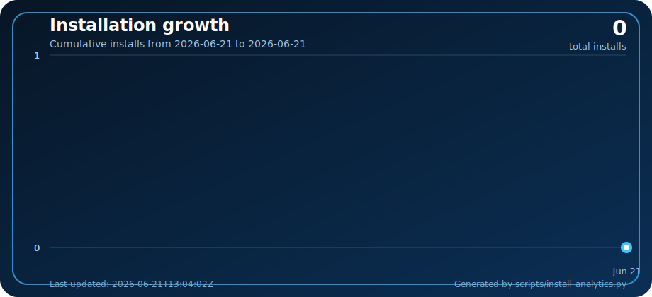

<p align="center">
  <a href="./README.md">🇺🇸 English</a> | <a href="./README_FA.md">🇮🇷 فارسی</a>
</p>

<p align="center">
  
</p>

# Darvish Bot

ربات حرفه‌ای فروش و مدیریت سرویس VPN برای پنل‌های X-UI و 3X-UI.

## 🚀 نصب سریع

```bash
bash <(curl -Ls https://raw.githubusercontent.com/officialdarvish/D_bot/main/install.sh)
```

## 📦 ریپازیتوری

```text
https://github.com/officialdarvish/D_bot
```

## امکانات

- پنل کاربر تلگرام
- پنل مدیریت
- مدیریت نماینده‌ها
- اتصال به X-UI و 3X-UI
- کیف پول و پرداخت کارت‌به‌کارت
- سیستم تیکت
- مدیریت چند سرور
- بکاپ و ریستور
- داکر و نصب یک‌خطی

## لینک‌ها

کانال تلگرام: https://t.me/officialdarvishchannel

ربات تلگرام: @officialdarvish_bot

لینک دونیت: https://nowpayments.io/donation/officialdarvish

## نمودار نصب

<p align="center">
  
</p>

## پرداخت کریپتو با NOWPayments

در این نسخه امکان ساخت پرداخت کریپتو از طریق NOWPayments اضافه شده است.

متغیرهای زیر را در `.env` تنظیم کنید:

```env
NOWPAYMENTS_ENABLED=true
NOWPAYMENTS_API_KEY=YOUR_API_KEY
NOWPAYMENTS_IPN_SECRET=YOUR_IPN_SECRET
NOWPAYMENTS_PAY_CURRENCY=trx
NOWPAYMENTS_IPN_CALLBACK_URL=https://YOUR_DOMAIN/webhooks/nowpayments
```

در پنل NOWPayments، کلید API و IPN Secret را از بخش Store/Payment settings دریافت کنید. وبهوک روی مسیر `/webhooks/nowpayments` آماده است و بعد از وضعیت‌های `confirmed / finished / sending` سفارش را پرداخت‌شده می‌کند و کانفیگ را برای خریدار ارسال می‌کند.

## تغییرات کد تخفیف

- کد تخفیف درصدی و مبلغی پشتیبانی می‌شود.
- هنگام ساخت کد می‌توانید سقف کلی استفاده و سقف استفاده برای هر کاربر را مشخص کنید.
- در لیست کدهای تخفیف، امکان مدیریت، تغییر مقدار، تغییر سقف کلی، تغییر سقف هر کاربر، فعال/غیرفعال کردن و حذف کد اضافه شد.
