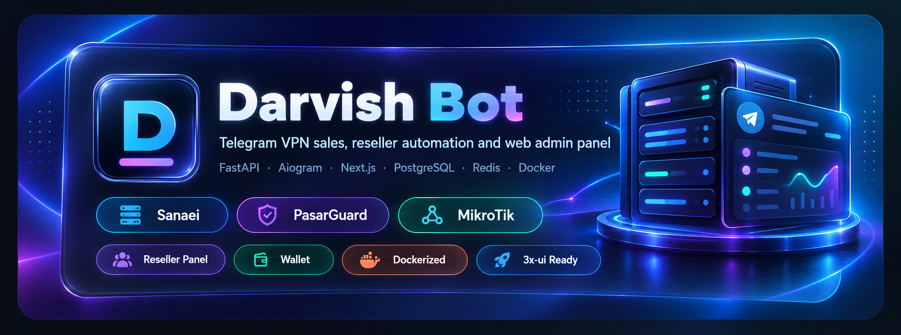
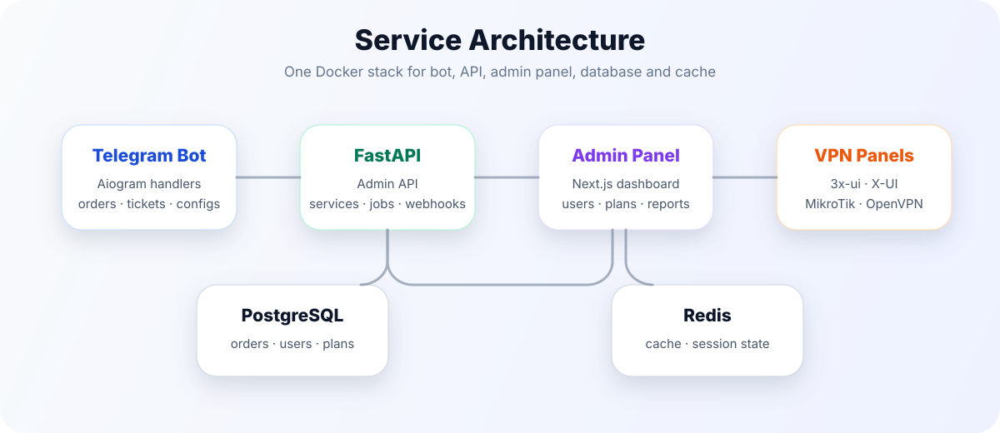

<p align="center">
  
</p>

<h1 align="center">Darvish Bot</h1>

<p align="center">
  <b>ربات حرفه‌ای فروش VPN، مدیریت نمایندگی و پنل ادمین تحت وب.</b>
</p>

<p align="center">
  <a href="./README.md">🇺🇸 English</a> · <a href="./README_FA.md">🇮🇷 فارسی</a>
</p>

<p align="center">
  <a href="https://t.me/officialdarvishchannel"></a>
  <a href="https://t.me/officialdarvish_bot"></a>
  <a href="https://nowpayments.io/donation/officialdarvish"></a>
</p>

<p align="center">
  
  
  
  
  
  
  
</p>

<p align="center">
  
</p>

---

<div dir="rtl">

## ✨ معرفی

**Darvish Bot** یک ربات تلگرام و پنل مدیریت وب برای فروش و مدیریت سرویس‌های VPN است. این پروژه برای خرید سرویس، مدیریت کاربران، پلن‌های نمایندگی، کیف پول، پرداخت کارت‌به‌کارت، پرداخت کریپتو، تیکت، مدیریت سرورها، ارسال کانفیگ و گزارش‌گیری طراحی شده است.

<table>
  <tr>
    <td align="center"><b>🤖 ربات تلگرام</b><br/>پنل کاربر، خرید، کانفیگ و تیکت</td>
    <td align="center"><b>🖥️ پنل مدیریت</b><br/>کاربران، پلن‌ها، سرورها، پرداخت‌ها و گزارش‌ها</td>
    <td align="center"><b>👥 نمایندگی</b><br/>بسته حجم، کاربران نماینده و برگشت حجم</td>
  </tr>
  <tr>
    <td align="center"><b>🔗 اتصال پنل</b><br/>3x-ui، X-UI، Sanaei، PasarGuard و MikroTik</td>
    <td align="center"><b>💳 پرداخت‌ها</b><br/>کیف پول، کارت‌به‌کارت و NOWPayments</td>
    <td align="center"><b>🐳 Docker</b><br/>API، ربات، PostgreSQL و Redis</td>
  </tr>
</table>

### 🎨 رابط گرافیکی بخش Custom

رابط خود بخش **Custom** به‌طور کامل انگلیسی شده است؛ شامل عنوان‌ها، فیلترها، تگ‌های Category و User Stage، وضعیت‌ها، دکمه‌های ویرایش و پیام‌های تأیید. متن واقعی پیام‌های ربات تغییر نکرده و همچنان فارسی/زبان اصلی خودش باقی می‌ماند و در Editor و Preview جهت متن به‌صورت خودکار تشخیص داده می‌شود.

بخش **Custom** بر اساس مسیر واقعی تعامل کاربر ساخته می‌شود، نه اسکن عمومی همه رشته‌های فارسی پروژه. فقط متن‌هایی که کاربر عادی در مسیر شروع و منو، خرید، پرداخت و رسید، تحویل سرویس، تمدید، کانفیگ‌های من، کیف پول، تیکت، اکانت تست، نمایندگی، پیام خصوصی، زیرمجموعه‌گیری و هشدارهای سرویس می‌بیند وارد این بخش می‌شوند. هر مورد دو تگ واضح انگلیسی **Category** و **User Stage** دارد و برای هر دو فیلتر مستقل اضافه شده است. پیام‌های داینامیک مهم مثل پیام نهایی بعد از تأیید رسید، کارت کامل تحویل سرویس و پیام نتیجه تمدید نیز به Template قابل ویرایش تبدیل شده‌اند. جستجوی Deferred و رندر مرحله‌ای برای حفظ سرعت پنل باقی مانده است.

### 🎥 یوتیوب

- [کانال رسمی Official Darvish در یوتیوب](https://www.youtube.com/@officialdarvish)
- [ویدیوی معرفی D Bot و آموزش نصب](https://youtu.be/gzTt6hj752A?si=NP7Mwnb17jMunGaH)

---

## 🚀 نصب سریع

نصب روی VPS تازه با یک دستور:

```bash
bash <(curl -Ls https://raw.githubusercontent.com/officialdarvish/D_bot/main/install.sh)
```

نصب‌کننده **قبل از هر تنظیم دیگری دامنه را می‌پرسد**. سپس Nginx را نصب و فعال می‌کند، مسیر ACME را آزمایش می‌کند و همان ابتدا گواهی Let’s Encrypt می‌گیرد. تا زمانی که Docker و برنامه کامل بالا بیایند، روی دامنه یک صفحه HTTPS با متن «نصب در حال انجام است» نمایش داده می‌شود. اتصال Nginx به API فقط بعد از موفق‌شدن `/health` انجام می‌شود؛ بنابراین کاربر با صفحه موقت 502 روبه‌رو نمی‌شود.

| مرحله | اتفاقی که می‌افتد |
|---|---|
| ابتدا | دریافت دامنه و ایمیل اختیاری Let’s Encrypt، بررسی DNS و پورت‌های ۸۰/۴۴۳، اجرای Nginx و صدور فوری SSL |
| ۱ | توکن ربات تلگرام و آیدی عددی Owner/Admin |
| ۲ | یوزرنیم و پسورد پنل وب، به‌صورت خودکار یا دستی |
| ۳ | نام دیتابیس PostgreSQL، یوزر و پسورد دیتابیس |
| ۴ | پورت داخلی API، تایم‌زون و لینک اختیاری کانال تلگرام |
| ۵ | نمایش خلاصه نهایی قبل از ساخت `.env` و اجرای سرویس‌ها |

<details>
<summary>نمونه منوی نصب</summary>

```text
╔══════════════════════════════════════════════════════════════╗
║                    D Bot Setup Wizard                       ║
╠══════════════════════════════════════════════════════════════╣
║ Fill the required values step by step.                      ║
║ Secrets will be saved only inside /opt/d-bot/.env.          ║
╚══════════════════════════════════════════════════════════════╝

First stage — Domain & SSL
Domain name: panel.example.com
Let’s Encrypt email, optional: admin@example.com
Start Nginx and request SSL now? [Y/n]: y
✓ صفحه موقت HTTPS فعال شد: https://panel.example.com

Step 1/5 — Telegram Bot
Telegram Bot Token: 123456789:AAExample_Token-Value
Owner/Admin Telegram ID: 123456789

Step 2/5 — Web Admin Panel
Auto-generate web admin username/password? [Y/n]: y

Step 5/5 — Review
SSL certificate    : active
Web login          : https://panel.example.com/login
Web username       : admin_a1b2c3
Save this setup and continue installation? [Y/n]: y
```

</details>

بعد از نصب، برای باز شدن منوی گرافیکی Control Center از یکی از این دو دستور استفاده کنید؛ از همین منو می‌توانید اطلاعات Setup Wizard را ببینید، تغییر دهید و سرویس‌ها را مدیریت کنید:

```bash
dbot
dbot menu
```

یا فقط از این دستورهای مستقیم مدیریتی استفاده کنید:

```bash
dbot status
dbot logs
dbot restart
dbot start
dbot stop
dbot update
dbot backup
dbot credentials
dbot uninstall --purge
```

---

## 🧩 امکانات

| بخش | توضیحات |
|---|---|
| 🤖 پنل کاربر تلگرام | خرید سرویس، مدیریت کانفیگ‌ها، تمدید، حذف کانفیگ، کیف پول، تیکت، راهنما، پیام وضعیت ساخت/تمدید و دکمه خانه بعد از موفقیت |
| 🖥️ پنل مدیریت وب | مدیریت کاربران، پلن‌ها، دسته‌بندی‌ها، سرورها، پرداخت‌ها، گزارش‌ها، تست اکانت، تنظیمات و مدیریت کیف پول کاربران |
| 👥 سیستم نمایندگی | بسته‌های نمایندگی، مصرف تجمعی، حجم رزروشده فعال، ظرفیت باقی‌مانده، کاربران نماینده و اعلان کوتاه ساخت کانفیگ برای مدیر |
| 🔗 اتصال به X-UI / 3x-ui | ساخت، حذف، تمدید، تغییر UUID و همگام‌سازی کلاینت‌ها |
| 🛡️ اتصال به PasarGuard | پشتیبانی از Owner، Administrator و ادمین محدود نمایندگی با Scope اختصاصی OWN از REST API رسمی PasarGuard |
| 🌐 MikroTik / OpenVPN | ساخت و مدیریت یوزر برای سرویس‌های MikroTik-based |
| 🧭 چند سرور | افزودن چند سرور، دسته‌بندی سرورها، نوع سرویس و inbound ID |
| 💳 کیف پول و پرداخت | پرداخت از کیف پول، افزایش/کاهش کیف پول توسط مدیر با آیدی عددی، پرداخت کارت‌به‌کارت، تایید رسید و پیگیری سفارش |
| ₿ پرداخت کریپتو | اتصال به NOWPayments و پشتیبانی از IPN Webhook |
| 🏷️ کد تخفیف | تخفیف درصدی/مبلغی، سقف استفاده کلی، سقف استفاده هر کاربر و محدودسازی روی سرور |
| 🎫 تیکت | ارسال تیکت توسط کاربر، پاسخ ادمین و بستن تیکت |
| 🔔 اعلان‌های مدیریتی | ارسال اطلاعات کاربر جدید، اعلان ساخت کانفیگ نماینده و گزارش خطای کوتاه و مرتب برای Owner/Admin |
| 🧰 بکاپ و ریستور | بکاپ پرتابل بین نصب‌ها، همگام‌سازی کامل دیتابیس، رمزگذاری مجدد اطلاعات سرورها و ابزار مهاجرت |
| 🔐 Credentials Center | نمایش لینک ورود، یوزرنیم و پسورد فعلی، تغییر مستقیم یوزرنیم/پسورد، ساخت رمز امن و مشاهده کلیدهای زیرساخت |
| 🐳 اجرای Docker | اجرای API، ربات، PostgreSQL، Redis و پنل مدیریت در یک ساختار Docker-based |

---

## 🧳 بکاپ پرتابل و ریستور روی VPS یا ربات دیگر

بکاپ‌هایی که از پنل مدیریت وب ساخته می‌شوند با فرمت پرتابل `4` هستند و می‌توان آن‌ها را روی VPS دیگر یا روی چند نصب جداگانه D BOT ریستور کرد.

- تمام جدول‌های دائمی پشتیبانی‌شده دیتابیس داخل بکاپ قرار می‌گیرند و هنگام ریستور با فایل بکاپ سینک می‌شوند.
- رمز پنل سرورها داخل یک محفظه رمزگذاری‌شده و مستقل از VPS ذخیره می‌شود و هنگام ریستور با `FERNET_KEY` نصب مقصد دوباره رمزگذاری می‌شود.
- فایل `.env`، توکن اصلی ربات (`BOT_TOKEN`)، اتصال دیتابیس و زیرساخت مقصد تغییر نمی‌کنند؛ بنابراین هر نصب می‌تواند هویت ربات خودش را نگه دارد.
- Checksum از نوع SHA-256 ناقص یا دستکاری‌شدن فایل را تشخیص می‌دهد.
- قبل از پاک‌شدن اطلاعات مقصد، ساختار فایل و قابلیت بازیابی رمزهای سرورها بررسی می‌شود.
- بکاپ‌های قدیمی فرمت `1` تا `3` فقط زمانی کامل بازیابی می‌شوند که رمزهای آن‌ها با کلید فعلی قابل خواندن باشند. برای بکاپ قدیمیِ ساخته‌شده با `FERNET_KEY` متفاوت، ابتدا سورس نصب مبدا را آپدیت کنید و یک بکاپ پرتابل جدید بگیرید.

اگر فقط فایل JSON قدیمی و `FERNET_KEY` مبدا را دارید، آن را به‌صورت محلی تبدیل کنید:

```bash
python3 scripts/convert_legacy_backup.py dbot_backup.json dbot_portable_backup_v4.json
```

اسکریپت، کلید قدیمی را به‌صورت مخفی درخواست می‌کند یا آن را از متغیر `LEGACY_FERNET_KEY` می‌خواند.

> فایل بکاپ پرتابل شامل اطلاعات قابل‌بازیابی سرورهاست؛ آن را محرمانه نگه دارید و فقط در مقصد مطمئن ذخیره یا ارسال کنید.

---

## ⛓️ پنل‌های پشتیبانی‌شده

<table>
  <tr>
    <td align="center"><b>3x-ui</b></td>
    <td align="center"><b>X-UI</b></td>
    <td align="center"><b>Sanaei X-UI</b></td>
    <td align="center"><b>PasarGuard</b></td>
    <td align="center"><b>MikroTik / OpenVPN</b></td>
    <td align="center"><b>Multi-inbound Xray</b></td>
  </tr>
</table>

### 🛡️ PasarGuard و ادمین محدود نمایندگی

سرور PasarGuard از REST API رسمی خود PasarGuard استفاده می‌کند و دسترسی Owner الزامی نیست. D Bot هم ساختار RBAC نسخه‌های جدید و هم پنل‌های قدیمی/Legacy نمایندگی را که `role.permissions` کامل را در `/api/admin` برنمی‌گردانند پشتیبانی می‌کند.

برای ادمین محدود/نمایندگی، Scope و محدودیت‌های خود PasarGuard کاملاً رعایت می‌شوند:

- دسترسی `users.create` برای ساخت سرویس لازم است.
- دسترسی `users.read` می‌تواند روی **OWN** باشد؛ در این حالت D Bot فقط سرویس‌هایی را می‌بیند که متعلق به همان ادمین نمایندگی هستند.
- دسترسی `users.delete` نیز می‌تواند **OWN** باشد. این دسترسی برای حذف دستی سرویس و روش جایگزین delete/recreate کاربرد دارد، اما برای ثبت سرور یا فروش عادی سرویس جدید شرط اجباری نیست.
- برای تمدید معمولی، `users.update` و `users.reset_usage` پیشنهاد می‌شوند. اگر Reset مجاز نباشد ولی Update مجاز باشد، لینک ساب حفظ می‌شود و حجم کل طوری افزایش پیدا می‌کند که کاربر یک حجم کامل جدید در اختیار داشته باشد. اگر Update/Reset مجاز نباشد ولی Create/Delete مجاز باشد، D Bot در آخرین مرحله یوزر متعلق به همان ادمین را با همان Username دوباره می‌سازد.
- دسترسی `groups.read_simple` پیشنهاد می‌شود ولی اجباری نیست. تشخیص Group کاملاً خودکار است: Groupهای قابل مشاهده در API → `allowed_group_ids` خود Role → Groupهای مشاهده‌شده روی یوزرهای متعلق به همان ادمین → Groupهای موجود در Templateهای مجاز/قابل مشاهده → آخرین Cache خودکار همگام‌شده. برای پنل‌های Legacy، اگر Endpoint سبک Group وجود نداشته باشد Endpoint کامل لیست Group هم امتحان می‌شود. اگر RBAC جدید صراحتاً `allowed_group_ids=[]` بدهد همان محدودیت رعایت می‌شود و در Add Server هیچ فیلد Group ID دستی وجود ندارد.
- اگر Role دارای `require_template=true` باشد، D Bot از Endpoint رسمی Template استفاده می‌کند. Template ID هنگام افزودن سرور وارد نمی‌شود؛ D Bot Templateهای مجاز/قابل مشاهده را خودکار شناسایی می‌کند و برای هر پلن بر اساس حجم، مدت، Group و HWID نزدیک‌ترین Template معتبر را انتخاب می‌کند.
- محدودیت‌هایی مثل تعداد یوزر، بازه حجم/انقضا و HWID توسط خود PasarGuard اعمال می‌شوند و D Bot آن‌ها را دور نمی‌زند.
- در پلن‌های عمومی برای **Sanaei/3x-ui و PasarGuard** می‌توان HWID Limit مستقل ثبت کرد. سرویس‌های PasarGuard در بخش **کانفیگ‌های من** تعداد و مشخصات HWIDهای ثبت‌شده را نمایش می‌دهند و کاربر می‌تواند با دکمه **ریست آیدی سخت‌افزار** همه HWIDهای سرویس خودش را از طریق API رسمی مبتنی بر User ID پاک کند. تغییر HWID Limit پلن نیز روی سرویس‌های فعال PasarGuard همگام می‌شود.

در **Admin Web → Service Types** برای هر نوع سرویس یک **Backend provider** مشخص می‌شود. اگر پلن روی سرور PasarGuard ساخته شده، Provider همان نوع سرویس را روی **PasarGuard** بگذارید؛ برای 3x-ui/Sanaei گزینه **X-UI / 3x-ui** و برای OpenVPN/L2TP گزینه **MikroTik** است. حالت **Auto detect** برای سازگاری با تنظیمات قدیمی باقی مانده است. منوی خرید فقط دسته‌هایی را نمایش می‌دهد که واقعاً روی Provider انتخاب‌شده پلن فعال دارند و هنگام ذخیره پلن، لینک Category به Server انتخاب‌شده نیز هماهنگ می‌شود.

در **Admin Web → Servers → Add Server** نوع **PasarGuard** را انتخاب کنید و آدرس داشبورد یا Origin پنل را وارد کنید؛ مسیرهای Subpath مثل `/hub/` هم پشتیبانی می‌شوند. احراز هویت می‌تواند با نام کاربری/رمز یا **API Token Panel** انجام شود. سپس **Test & Auto Fill** را بزنید تا D Bot مسیر واقعی API، Scope نمایندگی، Groupهای مجاز و Templateهای مجاز را خودکار تشخیص دهد. اگر پنل Metadata کامل RBAC را ندهد، D Bot از Probeهای فقط‌خواندنی استفاده می‌کند. هنگام افزودن سرور هیچ Group ID یا Template ID به‌صورت دستی وارد نمی‌شود.

### 🌐 پنل وب دو‌زبانه

پنل وب از **EN / FA** در Sidebar پشتیبانی می‌کند. انگلیسی LTR و فارسی RTL است و زبان انتخاب‌شده در مرورگر حفظ می‌شود. داده‌های کاربران و متن واقعی پیام‌های Telegram به‌صورت خودکار ترجمه نمی‌شوند.

### 🔌 کانکشن تلگرام

بخش **Connection** فقط ترافیک Telegram ربات را از مسیر انتخابی عبور می‌دهد و از Direct، پروکسی HTTP/SOCKS، MikroTik SOCKS5 و V2/Xray شامل `VLESS`، `VMess`، `Trojan` و `Shadowsocks` پشتیبانی می‌کند. اطلاعات حساس کانکشن رمزگذاری می‌شوند و قبل از اعمال مسیر امکان تست اتصال Telegram وجود دارد.

---


## 🎛️ مرکز شخصی‌سازی متن‌های ربات (Custom)

در وب‌پنل مدیریت، بخش **Custom** مستقیماً بالای **Settings** قرار گرفته است. کاتالوگ این بخش فقط روی **تعامل کاربر عادی با ربات** تمرکز دارد و دیگر همه متن‌های فارسی پروژه را جمع‌آوری نمی‌کند. فقط مسیرهای عمومی ربات و اعلان‌هایی که به خود کاربر ارسال می‌شوند اسکن می‌شوند؛ بخش‌های ادمین، متن‌های داخلی، Callback Data، API/Database، لاگ و رشته‌های فنی حذف شده‌اند. هر پیام یا دکمه در رابط وب با یک تگ انگلیسی **Category** (مثل Purchase & Payment، My Configs، Account & Wallet، Support & Tickets و Reseller) و یک تگ دقیق‌تر انگلیسی **User Stage** (مثل Payment, Receipt & Approval، Service Creation & Delivery و Renewal Result Message) نمایش داده می‌شود؛ اما خود متن پیام ربات فارسی باقی می‌ماند. پیام‌های ترکیبی مهم نیز به Template کامل تبدیل شده‌اند؛ از جمله پیام نهایی پس از تأیید رسید کارت‌به‌کارت، کارت کامل سرویس تحویل‌شده، نتیجه تمدید و پیام رد رسید. Placeholderهای پویا مثل نام کاربری، پلن، مبلغ، حجم و تاریخ در زمان ویرایش حفظ می‌شوند. Overrideها همچنان در جدول `settings` ذخیره می‌شوند و Migration جدیدی لازم نیست.

<!-- D BOT Custom Text Center -->

## 🏗️ ساختار و معماری

<p align="center">
  
</p>

```text
Darvish Bot
├── app/                  بک‌اند، هندلرهای ربات، API، jobها و سرویس‌ها
├── frontend/             سورس پنل مدیریت Next.js
├── scripts/              اسکریپت‌های کمکی
├── Dockerfile            فایل build اصلی Docker
├── docker-compose.yml    سرویس‌های API، ربات، PostgreSQL و Redis
├── install.sh            نصب‌کننده یک‌خطی VPS
├── README.md             مستندات انگلیسی
└── README_FA.md          مستندات فارسی
```

---

## 📦 نصب دستی

```bash
git clone https://github.com/officialdarvish/D_bot.git
cd D_bot
cp .env.example .env
nano .env
docker compose up -d --build
```

آدرس پنل مدیریت:

```text
https://YOUR_DOMAIN/login
```

---

## ⚙️ تنظیمات محیطی

فایل `.env` را در ریشه پروژه بسازید و مقدارهای خصوصی خودتان را داخل آن قرار دهید.

```env
BOT_TOKEN=CHANGE_ME_BOT_TOKEN
OWNER_IDS=123456789
DATABASE_URL=postgresql+asyncpg://dbot:CHANGE_ME_DB_PASSWORD@db:5432/d_bot
POSTGRES_DB=d_bot
POSTGRES_USER=dbot
POSTGRES_PASSWORD=CHANGE_ME_DB_PASSWORD
WEB_ADMIN_USERNAME=admin
WEB_ADMIN_PASSWORD=CHANGE_ME_STRONG_PASSWORD
FERNET_KEY=CHANGE_ME_FERNET_KEY
JWT_SECRET=CHANGE_ME_JWT_SECRET
```

> فایل `.env` واقعی، توکن ربات، API Key، اطلاعات پنل، IP سرورها و رمز دیتابیس را داخل GitHub منتشر نکنید.

---

## ₿ پرداخت کریپتو با NOWPayments

Darvish Bot می‌تواند از طریق NOWPayments فاکتور پرداخت کریپتو بسازد و با IPN Webhook وضعیت پرداخت را دریافت کند.

```env
NOWPAYMENTS_ENABLED=true
NOWPAYMENTS_API_KEY=YOUR_API_KEY
NOWPAYMENTS_IPN_SECRET=YOUR_IPN_SECRET
NOWPAYMENTS_PAY_CURRENCY=trx
NOWPAYMENTS_PRICE_CURRENCY=usd
NOWPAYMENTS_IPN_CALLBACK_URL=https://YOUR_DOMAIN/webhooks/nowpayments
```

مسیر Webhook:

```text
/webhooks/nowpayments
```

بعد از وضعیت‌های نهایی مثل `confirmed`، `finished` یا `sending` سفارش پرداخت‌شده محسوب می‌شود.

---

## 🏷️ کدهای تخفیف

سیستم کد تخفیف از موارد زیر پشتیبانی می‌کند:

- تخفیف درصدی
- تخفیف مبلغی ثابت
- سقف استفاده کلی
- سقف استفاده برای هر کاربر
- محدودسازی روی سرور/دسته‌بندی خاص
- فعال/غیرفعال کردن، ویرایش و حذف از پنل مدیریت

---

## 🕹️ مرکز کنترل گرافیکی

نصب‌کننده یک مرکز کنترل تعاملی برای VPS اضافه می‌کند. برای باز کردن آن بزنید:

```bash
dbot
```

این منو حالا می‌تواند **اطلاعاتی که در Setup Wizard وارد شده‌اند را نمایش دهد و تغییر بدهد**. مقدارهای حساس به‌صورت پیش‌فرض مخفی هستند و فقط با تایید شما داخل ترمینال نمایش داده می‌شوند.

```text
╔══════════════════════════════════════════════════════════════╗
║                    D Bot Control Center                     ║
║        Setup viewer, editor and VPS service manager         ║
╚══════════════════════════════════════════════════════════════╝

Project : D Bot
Path    : /opt/d-bot
Panel   : https://panel.example.com/login
Domain  : panel.example.com
HTTPS   : true

1) Status                  نمایش وضعیت کانتینرها
2) Logs                    نمایش لاگ زنده، خروج با Ctrl+C
3) Restart                 ریستارت همه سرویس‌ها
4) Start                   شروع سرویس‌ها
5) Stop                    توقف سرویس‌ها
6) Update                  دریافت آپدیت، rebuild و اجرای دوباره
7) Backup                  ساخت بکاپ کامل
8) Setup Info              نمایش اطلاعات واردشده در نصب
9) Edit Setup              تغییر مقدارهای ذخیره‌شده در .env
10) Apply Nginx/SSL        اعمال دوباره Nginx و گواهی SSL
11) Credentials Center     نمایش زنده و تغییر یوزرنیم/پسورد و اطلاعات حساس
12) Uninstall --purge      حذف کامل برنامه و بکاپ‌ها
13) Delete Old Backup      لیست و حذف بکاپ‌های قدیمی
0) Exit                    خروج
```

بخش‌هایی که از داخل منو قابل تغییر هستند:

| بخش | مقدارهای قابل تغییر |
|---|---|
| Telegram | توکن ربات، آیدی ادمین/اونر، لینک کانال پیش‌فرض |
| Website & SSL | دامنه، فعال/غیرفعال کردن HTTPS، ایمیل Let’s Encrypt، پورت داخلی API و پورت‌های HTTP/HTTPS مربوط به Nginx |
| Web Admin | نمایش زنده و تغییر نام کاربری/رمز از Credentials Center با همگام‌سازی مستقیم دیتابیس |
| Runtime | تایم‌زون و فاصله زمانی همگام‌سازی سرورها |
| Database | مقدارهای PostgreSQL همراه با هشدار امنیتی پیشرفته |

دستورهای باز کردن Control Center:

| دستور | توضیح |
|---|---|
| `dbot` | باز کردن منوی گرافیکی Control Center |
| `dbot menu` | باز کردن همان منوی مدیریتی داخل VPS |

دستورهای مستقیم هم پشتیبانی می‌شوند:

| دستور | توضیح |
|---|---|
| `dbot status` | نمایش وضعیت کانتینرها |
| `dbot logs` | نمایش لاگ زنده |
| `dbot restart` | ریستارت همه سرویس‌ها |
| `dbot start` | شروع سرویس‌ها |
| `dbot stop` | توقف سرویس‌ها |
| `dbot update` | دریافت آپدیت، rebuild و اجرای دوباره |
| `dbot backup` | ساخت بکاپ |
| `dbot backups` | باز کردن مدیریت بکاپ‌ها و حذف تکی/همه |
| `dbot backup-list` | نمایش لیست بکاپ‌ها از قدیمی به جدید |
| `dbot credentials` | باز کردن مستقیم Credentials Center گرافیکی و زنده |
| `dbot uninstall --purge` | حذف کامل برنامه و بکاپ‌ها |

---

## 🔐 چک‌لیست امنیت قبل از انتشار عمومی

- فایل `.env` واقعی را commit نکنید.
- آدرس پنل، یوزرنیم، پسورد، توکن و اطلاعات سرور را داخل کد نگذارید.
- فایل‌های runtime مثل log، backup، dump، zip و cache را حذف کنید.
- در نمونه‌ها فقط از مقدارهای امن مثل `CHANGE_ME` استفاده کنید.
- هر توکنی که حتی یک‌بار عمومی شده را حتماً rotate کنید.

---

## 🔗 لینک‌های رسمی

| پلتفرم | لینک |
|---|---|
| کانال تلگرام | [officialdarvishchannel](https://t.me/officialdarvishchannel) |
| ربات تلگرام | [@officialdarvish_bot](https://t.me/officialdarvish_bot) |
| ریپازیتوری گیت‌هاب | [officialdarvish/D_bot](https://github.com/officialdarvish/D_bot) |
| دونیت | [NOWPayments](https://nowpayments.io/donation/officialdarvish) |

---

## ❤️ حمایت از پروژه

اگر Darvish Bot برای شما مفید بود، می‌توانید از توسعه آینده پروژه با دونیت کریپتو حمایت کنید:

<p align="center">
  <a href="https://nowpayments.io/donation/officialdarvish">
    
  </a>
</p>

---

<p align="center">
  ساخته‌شده با ❤️ توسط <a href="https://github.com/officialdarvish">Darvish</a>
</p>
